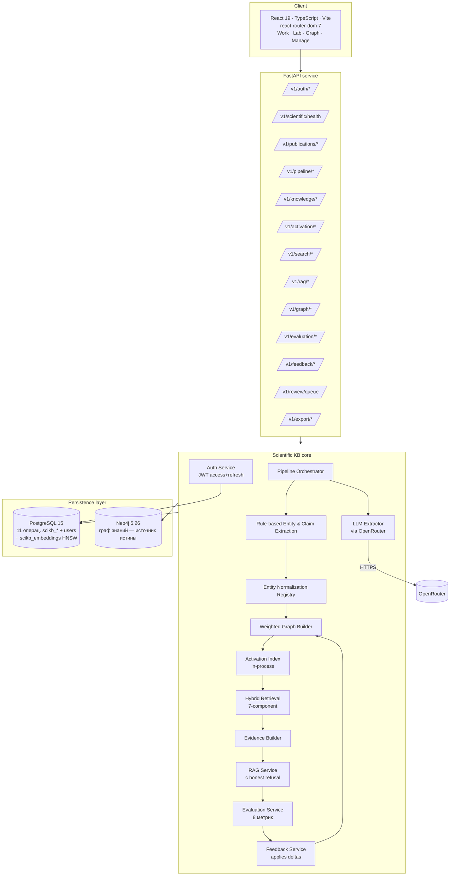
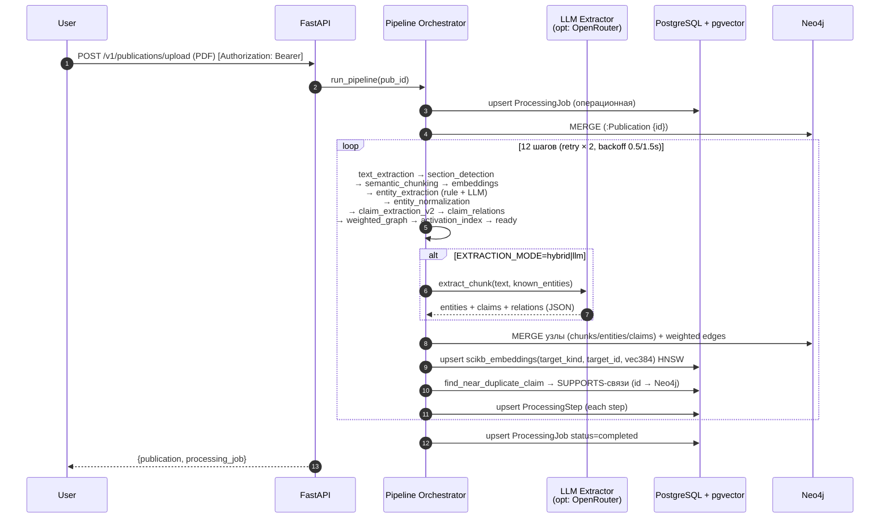
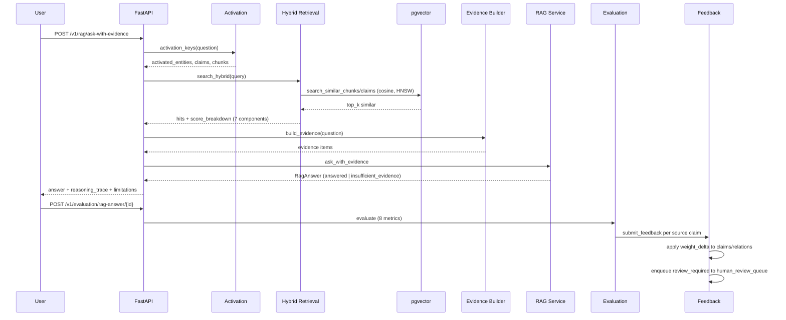

# Архитектура CognitiveBaseAI

> Evidence-based Scientific Reasoning Engine. **Neo4j-first** двухбазовая
> архитектура: **Neo4j** — единый источник истины для графовых данных
> (Publication, ScientificClaim, ScientificEntity, DocumentChunk,
> ResearchField и все рёбра); **PostgreSQL** — операционные таблицы
> (auth, jobs, RAG-history, evaluations, feedback) + единая таблица
> `scikb_embeddings` (pgvector + HNSW) для векторного поиска.

## 1. Компонентная диаграмма



## 2. Pipeline обработки публикации (12 шагов)



## 3. Query / Answer (hybrid + RAG)



## 4. Hybrid scoring (7 компонент)

```
hybrid_score = α·keyword
             + β·semantic
             + γ·(graph + 0.5·activation_bonus)
             + δ·claim_confidence
             + ε·evidence_strength
             + ζ·source_reliability
             − η·contradiction_risk
```

Веса по умолчанию: α=0.15, β=0.35, γ=0.20, δ=0.10, ε=0.15, ζ=0.05, η=0.10.
Конфигурируются через `HYBRID_*` env-переменные. Все компоненты возвращаются
в `score_breakdown` каждого hit'а и визуализируются во вкладке **Lab**
([ScoreBreakdown.tsx](../frontend/src/shared/ui/ScoreBreakdown.tsx)).

## 5. Feedback Loop

```
RAG answer evaluation (8 metrics)
   │
   ├─ faithfulness ≥ 0.8 → signal = positive
   │     ├─ claim.confidence_score += 0.03
   │     ├─ claim.evidence_strength += 0.015
   │     └─ SUPPORTS edges += 0.015
   │
   └─ faithfulness < 0.8 → signal = review_required
         ├─ claim.confidence_score -= 0.05
         └─ claim → human_review_queue
```

Resolve review-item ([feedback_service.py](../backend/app/features/scientific_kb/feedback_service.py)):

- `approve` → claim.confidence_score += 0.05;
- `reject` → claim.confidence_score -= 0.10.

## 6. Графовая модель Neo4j

```cypher
(:Author)-[:WROTE]->(:Publication)
(:Publication)-[:BELONGS_TO_FIELD]->(:ResearchField)
(:Publication)-[:CONTAINS_CHUNK]->(:DocumentChunk)
(:Publication)-[:CONTAINS_CLAIM {evidence_strength}]->(:ScientificClaim)
(:Publication)-[:CITES {context}]->(:Publication)
(:ScientificClaim)-[:MENTIONS_ENTITY]->(:ScientificEntity)
(:ScientificClaim)-[:SUPPORTS    {weight, confidence_score, evidence_strength}]->(:ScientificClaim)
(:ScientificClaim)-[:CONTRADICTS {weight, confidence_score, evidence_strength}]->(:ScientificClaim)
(:ScientificClaim)-[:LIMITS      {weight}]->(:ScientificClaim)
(:ScientificClaim)-[:EXTENDS     {weight}]->(:ScientificClaim)
```

Уникальные constraint'ы на `id` создаются автоматически в
[neo4j_adapter.py](../backend/app/features/scientific_kb/persistence/neo4j_adapter.py).

## 7. pgvector — векторный поиск без отдельной БД

Финальная форма после Neo4j-first рефакторинга — миграция
[2026051704_neo4j_first.py](../backend/alembic/versions/2026051704_neo4j_first.py)
дропает все графовые scikb_*-таблицы и создаёт **единую**
`scikb_embeddings(target_kind, target_id, embedding vector(384))`:

```sql
CREATE EXTENSION IF NOT EXISTS vector;

CREATE TABLE scikb_embeddings (
    id           uuid PRIMARY KEY DEFAULT gen_random_uuid(),
    target_kind  text NOT NULL,  -- 'chunk' | 'claim'
    target_id    text NOT NULL,  -- stable content-hash id узла Neo4j
    model        text NOT NULL,
    embedding    vector(384) NOT NULL,
    created_at   timestamptz NOT NULL DEFAULT now(),
    UNIQUE (target_kind, target_id)
);

CREATE INDEX ix_scikb_embeddings_hnsw
  ON scikb_embeddings USING hnsw (embedding vector_cosine_ops)
  WITH (m = 16, ef_construction = 64);
```

[PgVectorAdapter](../backend/app/features/scientific_kb/persistence/pgvector_adapter.py):

- `upsert_chunk_embeddings(pairs)` / `upsert_claim_embeddings(pairs)` — пишут с `target_kind='chunk'|'claim'`;
- `search_similar_chunks(vec, top_k)` / `search_similar_claims(vec, top_k)` — `WHERE target_kind = ... ORDER BY embedding <=> :vec LIMIT :k`;
- `find_near_duplicate_claim(vec, threshold=0.93, exclude_publication_id)` — используется pipeline'ом для дедупликации claims при upload.

После поиска `target_id` резолвится в полный узел через
`Neo4jAdapter.fetch_{chunks,claims}_by_ids(ids)` (Cypher batch-fetch).

## 8. JWT-аутентификация

[backend/app/features/auth/service.py](../backend/app/features/auth/service.py):

- bcrypt-хэширование пароля через `passlib`;
- PyJWT HS256, секрет из `JWT_SECRET_KEY`;
- access token: 15 минут (`JWT_ACCESS_TTL_SECONDS=900`);
- refresh token: 14 дней (`JWT_REFRESH_TTL_SECONDS=1209600`);
- `decode_token(token, expected_type)` валидирует подпись и тип.

[backend/app/features/auth/dependencies.py](../backend/app/features/auth/dependencies.py):

- `get_current_user` — FastAPI dependency для защищённых endpoint'ов;
- `get_current_user_optional` — мягкая проверка без 401.

Frontend ([api.ts](../frontend/src/api.ts)):

- автоматическое добавление `Authorization: Bearer <access>`;
- единый in-flight refresh при HTTP 401, повтор оригинального запроса.

## 9. Stable content-hash IDs (идемпотентный bootstrap)

Все ID узлов и рёбер генерируются через
[`_stable_id(prefix, *parts)`](../backend/app/features/scientific_kb/utils.py)
как SHA256-хеш контентных полей:

```python
def _stable_id(prefix: str, *parts: str | int | None, length: int = 16) -> str:
    payload = "|".join("" if p is None else str(p) for p in parts)
    digest = hashlib.sha256(payload.encode("utf-8")).hexdigest()[:length]
    return f"{prefix}_{digest}"
```

Формат: `pub_<16hex>`, `chunk_<16hex>`, `claim_<16hex>`, `ent_<16hex>`,
`rel_<16hex>`. Это даёт ключевые свойства Neo4j-first архитектуры:

- **Идемпотентность bootstrap'а**: повторные вызовы `bootstrap_persistence()`
  не создают дубликатов, потому что Cypher `MERGE` по `id` no-op'ит на
  существующих узлах;
- **Кросс-инстансная воспроизводимость**: одинаковый контент → один и тот же
  узел в любом инстансе Neo4j;
- **Дедупликация без cleanup**: больше не нужен `MATCH (n) DETACH DELETE n`
  перед каждым стартом — старые узлы и новые имеют одинаковые id.

## 10. Cache-miss fallback (Neo4j-first read path)

`search.py` и `rag.py` сначала ищут данные в in-memory кэше, при miss —
дёргают Cypher batch-fetch ([persistence/neo4j_adapter.py](../backend/app/features/scientific_kb/persistence/neo4j_adapter.py)):

- `fetch_chunks_by_ids(ids)` — `MATCH (c:DocumentChunk) WHERE c.id IN $ids RETURN c`
- `fetch_claims_by_ids(ids)` — аналогично для ScientificClaim
- `fetch_entities_by_ids(ids)` — для ScientificEntity
- `fetch_publications_by_ids(ids)` — для Publication

Это критично для семантического поиска через pgvector: при HNSW-поиске
возвращаются `target_id`, которые могут отсутствовать в in-memory копии
(например, после холодного старта с большим Neo4j-state'ом).

## 11. Graceful degradation

Каждый persistence-адаптер при первом обращении пытается подключиться;
при ошибке логирует warning и переходит в режим **disabled**. Pipeline
продолжает работать с in-memory state. Это позволяет:

- запускать `pytest` локально без поднятия PostgreSQL/Neo4j;
- продолжать обрабатывать запросы, если одна из БД временно недоступна.

`GET /health` отдаёт карту статусов: `postgres`, `neo4j`, `pgvector`,
плюс `embedding_provider` и `llm_active`.
