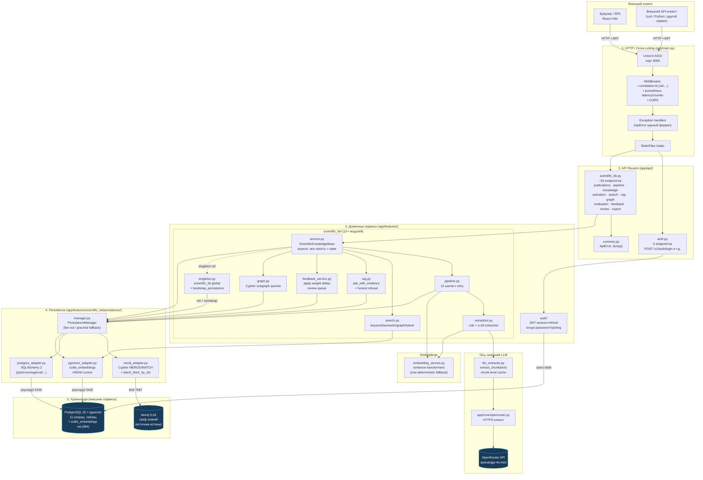
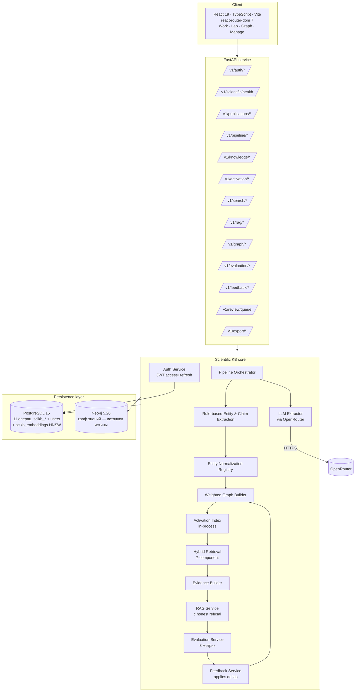
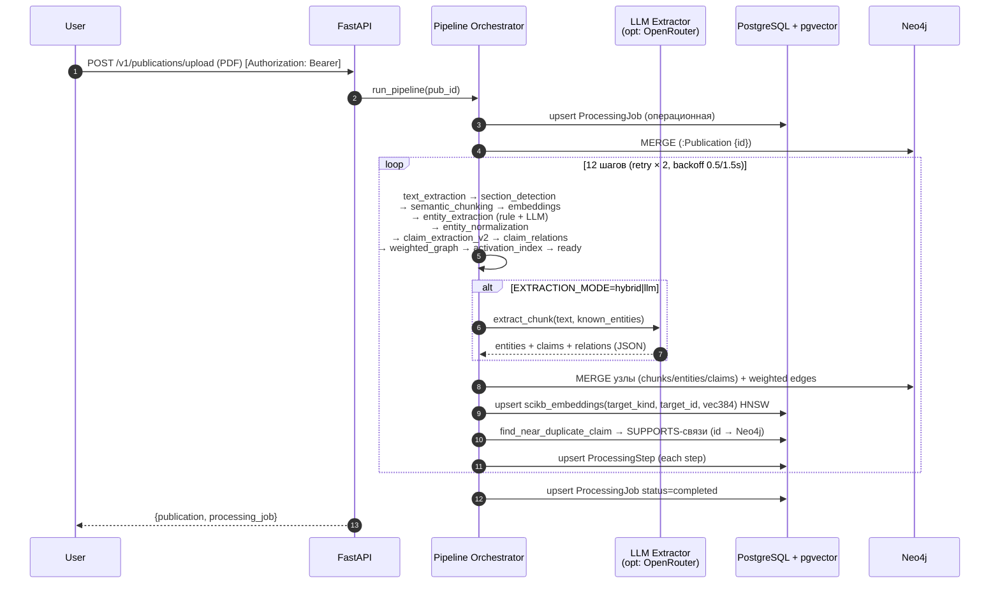
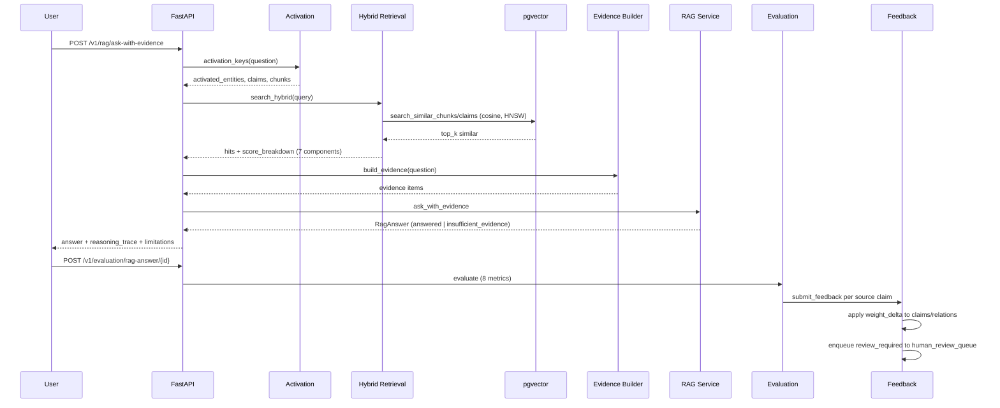

# Архитектура CognitiveBaseAI

> Evidence-based Scientific Reasoning Engine. **Neo4j-first** двухбазовая
> архитектура: **Neo4j** — единый источник истины для графовых данных
> (Publication, ScientificClaim, ScientificEntity, DocumentChunk,
> ResearchField и все рёбра); **PostgreSQL** — операционные таблицы
> (auth, jobs, RAG-history, evaluations, feedback) + единая таблица
> `scikb_embeddings` (pgvector + HNSW) для векторного поиска.

## 0. Архитектура серверной части

Backend FastAPI разложен по 5 слоям. Стрелки показывают направление
вызовов (сверху вниз). Каждый слой не знает о слое ниже как о конкретной
реализации — общается через интерфейс адаптера.



### Слои и их роли

| Слой | Что | Технологии |
|---|---|---|
| **1. HTTP / Cross-cutting** | uvicorn ASGI, middleware, exception handlers — то, что находится перед роутерами и работает на каждый запрос | Uvicorn · Starlette · prometheus_client |
| **2. API Routers** | Декларация endpoint'ов, парсинг Pydantic-схем, маппинг HTTP-кодов в `ApiError`. Логики тут нет — только маршрутизация в сервисы | FastAPI |
| **3. Доменные сервисы** | `ScientificKnowledgeBase`-агрегат с миксинами (Pipeline / Extraction / Search / RAG / Feedback / Graph). JWT-auth-сервис | чистый Python + dataclass'ы |
| **4. Persistence (адаптеры)** | Каждый адаптер — отдельный класс с методом `is_active()`. `PersistenceManager` делает fan-out на все три. При падении соединения адаптер логирует warning и возвращает `None` → graceful degradation | SQLAlchemy 2 · neo4j-python-driver · pgvector |
| **5. Внешние хранилища** | Neo4j 5 (граф), PostgreSQL 15 + pgvector (операционные + векторы) | Docker-контейнеры |

### Сторонние интеграции (вне слоёв)

| Сервис | Назначение | Активация |
|---|---|---|
| **OpenRouter** | LLM-извлечение сущностей и claims (gpt-4o-mini) | при `OPENROUTER_API_KEY` + `EXTRACTION_MODE=hybrid\|llm` |
| **sentence-transformers** | Векторизация text → 384-dim embeddings | при наличии пакета, иначе детерминированный hash-fallback |
| **Adminer** | UI для PostgreSQL | dev-профиль, порт 8080 |
| **Neo4j Browser** | UI для Cypher-запросов | dev-профиль, порт 7474 |
| **Prometheus + Grafana** | Метрики (опц.) | профиль `monitoring` |

### Ключевые архитектурные решения

1. **Neo4j-first** — граф знаний живёт **только** в Neo4j. PG хранит лишь операционные данные (jobs/runs/eval/feedback/users) + единую таблицу `scikb_embeddings`. Никакого дублирования графа в PG.

2. **Mixin-агрегат `ScientificKnowledgeBase`** — не классическая «service per file» декомпозиция, а композиция 6 mixin'ов в одном объекте. Это даёт shared in-memory state (`publications`/`chunks`/`claims`/...) для всех операций без передачи через параметры. Минус: единый бог-класс, плюс: высокая cohesion и простой код.

3. **Graceful degradation адаптеров** — каждый адаптер при первом обращении пытается подключиться; при ошибке логирует warning и возвращает `is_active()=False`. Сервисы работают на in-memory state. Это позволяет запускать тесты без поднятой инфраструктуры.

4. **Stable content-hash IDs** ([utils.py:_stable_id](../backend/app/features/scientific_kb/utils.py)) — все id'шники узлов и рёбер детерминированно вычисляются как SHA256 от контентных полей. Cypher `MERGE` идемпотентен между рестартами.

5. **Cache-miss fallback** — `search.py` и `rag.py` сначала ищут в in-memory state, при miss дергают Cypher batch-fetch из Neo4j. Критично для семантического поиска: pgvector возвращает `target_id`, который при отсутствии в кэше резолвится через `fetch_chunks_by_ids` / `fetch_claims_by_ids`.

6. **JWT с auto-refresh** — access 15 мин, refresh 14 дней; frontend `apiFetch` при 401 прозрачно обновляет токен и повторяет запрос. Stateless — на бэке нет blacklist'а refresh-токенов.

### Файловая карта серверной части

```
backend/app/
├── main.py                    # uvicorn entrypoint + lifespan + middleware
├── api/                       # ── Слой 2: HTTP routers ──
│   ├── auth.py                # /v1/auth/* (5 endpoints)
│   ├── scientific_kb.py       # /v1/* (~50 endpoints)
│   └── common.py              # ApiError, dump()
├── core/
│   └── openrouter.py          # HTTPS client (используется в LLM extractor)
├── config/
│   ├── settings.py            # Pydantic Settings: env vars, weights
│   └── environments/          # dev/stage/prod overrides
├── db/
│   ├── base.py                # SQLAlchemy DeclarativeBase
│   └── models.py              # User (для JWT auth)
└── features/                  # ── Слой 3: доменные сервисы ──
    ├── auth/
    │   ├── service.py         # AuthService: register/login/refresh
    │   └── dependencies.py    # FastAPI Depends(get_current_user)
    └── scientific_kb/
        ├── service.py         # ScientificKnowledgeBase агрегат (все mixin'ы)
        ├── pipeline.py        # 12-шаговый orchestrator с retry
        ├── extraction.py      # rule-based + LLM extraction
        ├── search.py          # 4 режима поиска + 7-компонентная формула
        ├── rag.py             # ask_with_evidence + honest refusal
        ├── feedback_service.py# apply weight deltas + review queue
        ├── graph.py           # Cypher subgraph queries для /v1/graph/*
        ├── embedding_service.py # sentence-transformers + fallback
        ├── llm_extractor.py   # OpenRouter обёртка с chunk-cache
        ├── ontology.py        # русская школьная онтология (200+ имён)
        ├── seed.py            # 12 авторов + 6 организаций + 24 цитирования
        ├── demo.py            # 20 русскоязычных статей в 5 кластерах
        ├── models.py          # dataclass-модели (ClaimRelation.created_by)
        ├── orm.py             # 11 операц. SQLAlchemy 2 моделей scikb_*
        ├── serialization.py   # dump() для API ответов
        ├── singleton.py       # глобальный scientific_kb + bootstrap
        ├── utils.py           # _stable_id + sentences + helpers
        └── persistence/       # ── Слой 4: адаптеры ──
            ├── manager.py     # PersistenceManager (fan-out)
            ├── neo4j_adapter.py
            ├── postgres_adapter.py
            └── pgvector_adapter.py
```

---

## 1. Компонентная диаграмма



## 2. Pipeline обработки публикации (12 шагов)



## 3. Query / Answer (hybrid + RAG)



## 4. Hybrid scoring (7 компонент)

```
hybrid_score = α·keyword
             + β·semantic
             + γ·(graph + 0.5·activation_bonus)
             + δ·claim_confidence
             + ε·evidence_strength
             + ζ·source_reliability
             − η·contradiction_risk
```

Веса по умолчанию: α=0.15, β=0.35, γ=0.20, δ=0.10, ε=0.15, ζ=0.05, η=0.10.
Конфигурируются через `HYBRID_*` env-переменные. Все компоненты возвращаются
в `score_breakdown` каждого hit'а и визуализируются во вкладке **Lab**
([ScoreBreakdown.tsx](../frontend/src/shared/ui/ScoreBreakdown.tsx)).

## 5. Feedback Loop

Подробное описание 8 метрик качества RAG-ответов (формулы, диапазоны,
интерпретация), пример полного расчёта — в [evaluation_metrics.md](evaluation_metrics.md).

```
RAG answer evaluation (8 metrics)
   │
   ├─ faithfulness ≥ 0.8 → signal = positive
   │     ├─ claim.confidence_score += 0.03
   │     ├─ claim.evidence_strength += 0.015
   │     └─ SUPPORTS edges += 0.015
   │
   └─ faithfulness < 0.8 → signal = review_required
         ├─ claim.confidence_score -= 0.05
         └─ claim → human_review_queue
```

Resolve review-item ([feedback_service.py](../backend/app/features/scientific_kb/feedback_service.py)):

- `approve` → claim.confidence_score += 0.05;
- `reject` → claim.confidence_score -= 0.10.

## 6. Графовая модель Neo4j

```cypher
(:Author)-[:WROTE]->(:Publication)
(:Publication)-[:BELONGS_TO_FIELD]->(:ResearchField)
(:Publication)-[:CONTAINS_CHUNK]->(:DocumentChunk)
(:Publication)-[:CONTAINS_CLAIM {evidence_strength}]->(:ScientificClaim)
(:Publication)-[:CITES {context}]->(:Publication)
(:ScientificClaim)-[:MENTIONS_ENTITY]->(:ScientificEntity)
(:ScientificClaim)-[:SUPPORTS    {weight, confidence_score, evidence_strength}]->(:ScientificClaim)
(:ScientificClaim)-[:CONTRADICTS {weight, confidence_score, evidence_strength}]->(:ScientificClaim)
(:ScientificClaim)-[:LIMITS      {weight}]->(:ScientificClaim)
(:ScientificClaim)-[:EXTENDS     {weight}]->(:ScientificClaim)
```

**Узлы**:

| Метка | Идентификатор | Свойства | Откуда |
|---|---|---|---|
| `Publication` | `id = pub_<16hex>` | title, abstract, year, authors[], organizations[], status, source_type | upload или demo |
| `ScientificClaim` | `id = claim_<16hex>` | claim_text, claim_type, subject_entity, predicate, object_entity, evidence_text, confidence_score, evidence_strength, source_reliability | extraction |
| `ScientificEntity` | `id = ent_<16hex>` | canonical_name, entity_type ∈ {Method, Model, Dataset, Metric, Task, Tool, Limitation, Result}, aliases[] | ontology + LLM |
| `DocumentChunk` | `id = chunk_<16hex>` | text, section, page_start, page_end, chunk_index, content_hash | semantic chunking |
| **`ResearchField`** | **`name = "Алгоритмы..."` (id = имя)** | только `name` | `publication.metadata.research_field` |

`ResearchField` — особый случай: это не запись в реестре `ScientificEntity`,
а отдельный тип узла, обозначающий тематическую область публикаций. Имя
области берётся из метаданных публикации, выбирается из закрытого списка
12 школьных областей в [ontology.py](../backend/app/features/scientific_kb/ontology.py)
(см. подробнее [data_model.md §4.1](data_model.md)). Из-за особого `id = name`
(не `_stable_id`-хеш), endpoint `/v1/knowledge/entities/{id}` для них **не работает** —
для деталей области используется `GET /v1/publications?research_field=<name>`.

Уникальные constraint'ы на `id` создаются автоматически в
[neo4j_adapter.py](../backend/app/features/scientific_kb/persistence/neo4j_adapter.py).

## 7. pgvector — векторный поиск без отдельной БД

Финальная форма после Neo4j-first рефакторинга — миграция
[2026051704_neo4j_first.py](../backend/alembic/versions/2026051704_neo4j_first.py)
дропает все графовые scikb_*-таблицы и создаёт **единую**
`scikb_embeddings(target_kind, target_id, embedding vector(384))`:

```sql
CREATE EXTENSION IF NOT EXISTS vector;

CREATE TABLE scikb_embeddings (
    id           uuid PRIMARY KEY DEFAULT gen_random_uuid(),
    target_kind  text NOT NULL,  -- 'chunk' | 'claim'
    target_id    text NOT NULL,  -- stable content-hash id узла Neo4j
    model        text NOT NULL,
    embedding    vector(384) NOT NULL,
    created_at   timestamptz NOT NULL DEFAULT now(),
    UNIQUE (target_kind, target_id)
);

CREATE INDEX ix_scikb_embeddings_hnsw
  ON scikb_embeddings USING hnsw (embedding vector_cosine_ops)
  WITH (m = 16, ef_construction = 64);
```

[PgVectorAdapter](../backend/app/features/scientific_kb/persistence/pgvector_adapter.py):

- `upsert_chunk_embeddings(pairs)` / `upsert_claim_embeddings(pairs)` — пишут с `target_kind='chunk'|'claim'`;
- `search_similar_chunks(vec, top_k)` / `search_similar_claims(vec, top_k)` — `WHERE target_kind = ... ORDER BY embedding <=> :vec LIMIT :k`;
- `find_near_duplicate_claim(vec, threshold=0.93, exclude_publication_id)` — используется pipeline'ом для дедупликации claims при upload.

После поиска `target_id` резолвится в полный узел через
`Neo4jAdapter.fetch_{chunks,claims}_by_ids(ids)` (Cypher batch-fetch).

## 8. JWT-аутентификация

[backend/app/features/auth/service.py](../backend/app/features/auth/service.py):

- bcrypt-хэширование пароля через `passlib`;
- PyJWT HS256, секрет из `JWT_SECRET_KEY`;
- access token: 15 минут (`JWT_ACCESS_TTL_SECONDS=900`);
- refresh token: 14 дней (`JWT_REFRESH_TTL_SECONDS=1209600`);
- `decode_token(token, expected_type)` валидирует подпись и тип.

[backend/app/features/auth/dependencies.py](../backend/app/features/auth/dependencies.py):

- `get_current_user` — FastAPI dependency для защищённых endpoint'ов;
- `get_current_user_optional` — мягкая проверка без 401.

Frontend ([api.ts](../frontend/src/api.ts)):

- автоматическое добавление `Authorization: Bearer <access>`;
- единый in-flight refresh при HTTP 401, повтор оригинального запроса.

## 9. Stable content-hash IDs (идемпотентный bootstrap)

Все ID узлов и рёбер генерируются через
[`_stable_id(prefix, *parts)`](../backend/app/features/scientific_kb/utils.py)
как SHA256-хеш контентных полей:

```python
def _stable_id(prefix: str, *parts: str | int | None, length: int = 16) -> str:
    payload = "|".join("" if p is None else str(p) for p in parts)
    digest = hashlib.sha256(payload.encode("utf-8")).hexdigest()[:length]
    return f"{prefix}_{digest}"
```

Формат: `pub_<16hex>`, `chunk_<16hex>`, `claim_<16hex>`, `ent_<16hex>`,
`rel_<16hex>`. Это даёт ключевые свойства Neo4j-first архитектуры:

- **Идемпотентность bootstrap'а**: повторные вызовы `bootstrap_persistence()`
  не создают дубликатов, потому что Cypher `MERGE` по `id` no-op'ит на
  существующих узлах;
- **Кросс-инстансная воспроизводимость**: одинаковый контент → один и тот же
  узел в любом инстансе Neo4j;
- **Дедупликация без cleanup**: больше не нужен `MATCH (n) DETACH DELETE n`
  перед каждым стартом — старые узлы и новые имеют одинаковые id.

## 10. Cache-miss fallback (Neo4j-first read path)

`search.py` и `rag.py` сначала ищут данные в in-memory кэше, при miss —
дёргают Cypher batch-fetch ([persistence/neo4j_adapter.py](../backend/app/features/scientific_kb/persistence/neo4j_adapter.py)):

- `fetch_chunks_by_ids(ids)` — `MATCH (c:DocumentChunk) WHERE c.id IN $ids RETURN c`
- `fetch_claims_by_ids(ids)` — аналогично для ScientificClaim
- `fetch_entities_by_ids(ids)` — для ScientificEntity
- `fetch_publications_by_ids(ids)` — для Publication

Это критично для семантического поиска через pgvector: при HNSW-поиске
возвращаются `target_id`, которые могут отсутствовать в in-memory копии
(например, после холодного старта с большим Neo4j-state'ом).

## 11. Graceful degradation

Каждый persistence-адаптер при первом обращении пытается подключиться;
при ошибке логирует warning и переходит в режим **disabled**. Pipeline
продолжает работать с in-memory state. Это позволяет:

- запускать `pytest` локально без поднятия PostgreSQL/Neo4j;
- продолжать обрабатывать запросы, если одна из БД временно недоступна.

`GET /health` отдаёт карту статусов: `postgres`, `neo4j`, `pgvector`,
плюс `embedding_provider` и `llm_active`.
