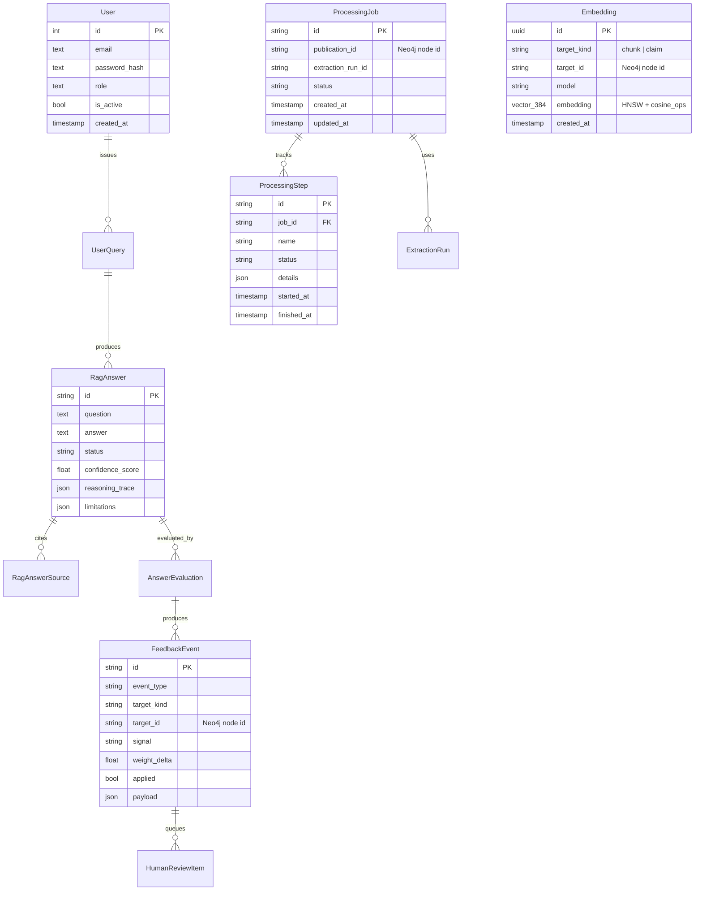

# Data Model

> **Neo4j-first архитектура.** Граф знаний (Publication, ScientificClaim,
> ScientificEntity, DocumentChunk, ResearchField и все рёбра) живёт **только
> в Neo4j** — это единый источник истины для графовых данных. PostgreSQL
> хранит операционные данные (auth, jobs, RAG history, evaluations, feedback)
> и единую таблицу embeddings (pgvector). In-memory state — горячий кэш
> и fallback при недоступности БД.

## 1. PostgreSQL — операционные таблицы

После Neo4j-first рефакторинга PG содержит **11 таблиц** `scikb_*` +
системную `users`. Все графовые таблицы (`scikb_publications`,
`scikb_document_chunks`, `scikb_scientific_claims`, `scikb_claim_relations`,
`scikb_scientific_entities`, `scikb_entity_aliases`, `scikb_entity_mentions`,
`scikb_publication_authors`, `scikb_publication_citations` и т.д.) удалены —
их роль выполняет Neo4j.

ORM-модели: [backend/app/features/scientific_kb/orm.py](../backend/app/features/scientific_kb/orm.py).

| Класс | Таблица | Назначение |
|-------|---------|-----------|
| `ProcessingJob` | `scikb_processing_jobs` | Pipeline-job (status, extraction_run_id) |
| `ProcessingStep` | `scikb_processing_steps` | 12 шагов pipeline (started_at, finished_at, details) |
| `ExtractionRun` | `scikb_extraction_runs` | Запуск extraction (model_version, prompt_template) |
| `UserQuery` | `scikb_user_queries` | История запросов пользователей |
| `RagAnswer` | `scikb_rag_answers` | Ответы RAG (status, confidence, reasoning_trace) |
| `RagAnswerSource` | `scikb_rag_answer_sources` | Источники для каждого ответа |
| `RetrievalExperiment` | `scikb_retrieval_experiments` | A/B-эксперименты с весами hybrid |
| `AnswerEvaluation` | `scikb_answer_evaluations` | 8 метрик качества |
| `FeedbackEvent` | `scikb_feedback_events` | Сигналы feedback (positive/review_required) |
| `HumanReviewItem` | `scikb_review_queue` | Очередь human-in-the-loop |
| `Embedding` | `scikb_embeddings` | **Единая** таблица векторов 384-dim (chunks + claims) |

### Миграции

| Миграция | Что делает |
|---|---|
| `7e9424fcd3ae_initial_schema.py` | Таблица `users` |
| `2026051502_scientific_kb_schema.py` | Изначальные 22 scikb_* таблицы (исторически) |
| `2026051603_pgvector_embeddings.py` | `CREATE EXTENSION vector`, колонки embedding в chunks/claims |
| **`2026051704_neo4j_first.py`** | **Drop'ает 13+ графовых таблиц, создаёт единую `scikb_embeddings`** |

## 2. PostgreSQL ER-диаграмма (операционные таблицы)



## 3. pgvector — единая таблица `scikb_embeddings`

```sql
CREATE EXTENSION IF NOT EXISTS vector;

CREATE TABLE scikb_embeddings (
    id           uuid PRIMARY KEY DEFAULT gen_random_uuid(),
    target_kind  text NOT NULL,    -- 'chunk' | 'claim'
    target_id    text NOT NULL,    -- ссылка на узел Neo4j (stable content-hash id)
    model        text NOT NULL,    -- 'sentence-transformers/all-MiniLM-L6-v2' | 'deterministic'
    embedding    vector(384) NOT NULL,
    created_at   timestamptz NOT NULL DEFAULT now(),
    UNIQUE (target_kind, target_id)
);

CREATE INDEX ix_scikb_embeddings_hnsw
  ON scikb_embeddings USING hnsw (embedding vector_cosine_ops)
  WITH (m = 16, ef_construction = 64);

CREATE INDEX ix_scikb_embeddings_target ON scikb_embeddings (target_kind, target_id);
```

Адаптер: [persistence/pgvector_adapter.py](../backend/app/features/scientific_kb/persistence/pgvector_adapter.py):

- `upsert_chunk_embeddings(pairs)` / `upsert_claim_embeddings(pairs)` — пишут с `target_kind='chunk'|'claim'`;
- `search_similar_chunks(vec, top_k)` / `search_similar_claims(vec, top_k)` — `WHERE target_kind = ... ORDER BY embedding <=> :vec LIMIT :k`;
- `find_near_duplicate_claim(vec, threshold=0.93, exclude_publication_id)` — для дедупликации claims на upload.

## 4. Neo4j — единый источник истины для графа

Узлы: `Publication`, `ScientificClaim`, `ScientificEntity`, `DocumentChunk`,
`ResearchField`. Уникальные constraint'ы на `id` создаются на старте
Neo4jAdapter ([persistence/neo4j_adapter.py](../backend/app/features/scientific_kb/persistence/neo4j_adapter.py)).

```cypher
// Publication ↔ ResearchField/Chunk/Claim
(:Publication)-[:BELONGS_TO_FIELD]->(:ResearchField)
(:Publication)-[:CONTAINS_CHUNK]->(:DocumentChunk)
(:Publication)-[:CONTAINS_CLAIM {evidence_strength}]->(:ScientificClaim)
(:Publication)-[:CITES {context}]->(:Publication)

// Claim ↔ Entity
(:ScientificClaim)-[:MENTIONS_ENTITY]->(:ScientificEntity)
(:ScientificClaim)-[:EVALUATED_BY]->(:ScientificEntity)   // если есть метрика

// Claim ↔ Claim (взвешенные)
(:ScientificClaim)-[:SUPPORTS    {weight, confidence_score, evidence_strength}]->(:ScientificClaim)
(:ScientificClaim)-[:CONTRADICTS {weight, confidence_score, evidence_strength}]->(:ScientificClaim)
(:ScientificClaim)-[:LIMITS      {weight}]->(:ScientificClaim)
(:ScientificClaim)-[:EXTENDS     {weight}]->(:ScientificClaim)
```

Авторы и организации хранятся **как поля Publication** (`p.authors[]`,
`p.organizations[]`) — это упрощает граф (нет отдельных WROTE-рёбер).

### Стабильные content-hash ID

Все ID (`pub_<16hex>`, `chunk_<16hex>`, `claim_<16hex>`, `ent_<16hex>`,
`rel_<16hex>`) генерируются через
[`_stable_id(prefix, *parts)`](../backend/app/features/scientific_kb/utils.py)
как SHA256-хеш контентных полей. Это значит:

- Cypher `MERGE` по `id` **идемпотентен между рестартами**;
- повторные bootstrap'ы не создают дубликатов;
- одинаковый контент → одинаковый узел в Neo4j (cross-environment reproducibility).

### CHECK-эквиваленты на уровне приложения

Так как графовые данные ушли из PG, ограничения на типы (claim_type,
relation_type, status) проверяются:

- в Pydantic-схемах API ([backend/app/api/scientific_kb.py](../backend/app/api/scientific_kb.py));
- в dataclass'ах ([models.py](../backend/app/features/scientific_kb/models.py)) — через `Literal[...]`;
- в онтологии ([ontology.py](../backend/app/features/scientific_kb/ontology.py)) — `CLAIM_TYPES`, `RELATION_TYPES`, `ENTITY_TYPES`.

## 5. In-memory структуры (горячий кэш)

[ScientificKnowledgeBase](../backend/app/features/scientific_kb/service.py)
хранит горячее состояние:

```text
publications      dict[id, Publication]
chunks            dict[id, DocumentChunk]
entities          dict[id, ScientificEntity]
claims            dict[id, ScientificClaim]
relations         dict[id, ClaimRelation]
jobs              dict[id, ProcessingJob]
rag_answers       dict[id, RagAnswer]
evaluations       dict[id, EvaluationRecord]
feedback_events   dict[id, FeedbackEvent]
review_queue      dict[id, ReviewItem]
user_queries      dict[id, dict]
activation_index  defaultdict[key, {entities, claims, chunks}]
demo_authors      dict[id, DemoAuthor]
demo_organizations dict[id, DemoOrganization]
demo_citations    list[dict]
persistence       PersistenceManager (postgres + neo4j + pgvector)
```

### Cache-miss fallback (Neo4j-first)

При cache miss `search.py` и `rag.py` достают данные из Neo4j через
batch-fetch методы:

- `Neo4jAdapter.fetch_chunks_by_ids(ids)` → `dict[id, payload]`
- `Neo4jAdapter.fetch_claims_by_ids(ids)` → `dict[id, payload]`
- `Neo4jAdapter.fetch_entities_by_ids(ids)` → `dict[id, payload]`
- `Neo4jAdapter.fetch_publications_by_ids(ids)` → `dict[id, payload]`

Это гарантирует, что **семантический поиск через pgvector работает даже
если in-memory кэш не содержит результата** (например, после bootstrap'а
из Neo4j без полной in-memory загрузки).

## 6. Bootstrap — Neo4j → in-memory

Pipeline пишет одновременно в in-memory state и через
[`PersistenceManager`](../backend/app/features/scientific_kb/persistence/manager.py)
в Neo4j + PG + pgvector. При рестарте backend:

1. `ScientificKnowledgeBase.__init__()` строит in-memory state из демо-корпуса
   (детерминированно, через `_stable_id`).
2. `bootstrap_persistence()` MERGE'ит in-memory state в Neo4j/PG/pgvector.
   Благодаря stable IDs — это **полностью идемпотентно**, дубликатов не возникает.
